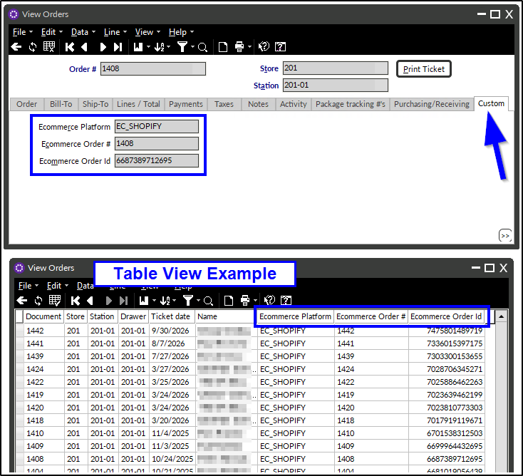

# Shopify Connector v3.02.02 Release Notes

_Release Date: October 8, 2026_

---

## New Functionality

### Importing Shopify Orders with Multiple Discounts

The connector can now import Shopify orders that have more than one discount applied. If the site allows customers to combine discount codes on a single Shopify order, each discount is now carried into Counterpoint accurately.

- An order-wide Shopify discount (a discount that applies to the entire order) is imported as a **document discount** on the Counterpoint order.
- A product-specific Shopify discount (a discount that applies only to certain products) is imported as a **line discount** on each affected line item.
- Orders that combine both types now import successfully with both the relevant document discount(s) and line discount(s) applied.
  - Additionally, when the same line discount code applies to multiple different line items, each line receives the correct discount amount.
- An issue that caused incorrect Gross Subtotal and Total Discounts values on orders with multiple discounts has also been corrected. These values, along with tax and total, now match the Shopify order.

### Ecommerce Fields Added to Order and Ticket Views

The ecommerce fields recently added to the Counterpoint order and ticket header are now visible on a new Custom tab (and in table view). Previously, these values were stored in the database but were not easily accessed. This change makes it easy to see which ecommerce platform an order or ticket originated from. 

- The new **Custom tab** displays the following fields:
  - **Ecommerce Platform** (for example, `EC_SHOPIFY`)
  - **Ecommerce Order #** (the order number shown in Shopify)
  - **Ecommerce Order Id** (the unique ID Shopify assigns to the order)
- The Custom tab has been added to the following views:
  - View Orders (`VI_PS_DOC_HDR`)
  - View Order History (`VI_PS_ORD_HIST`)
  - View Tickets (`VI_PS_DOC_HDR`)
  - View Ticket History (`VI_PS_TKT_HIST`)
- New data dictionary entries and custom forms have been added so that these fields display with clear labels.

### Dedicated SQL Login for the Connector

_Please check back tomorrow for additional details._

---

## Bug Fixes and Performance Enhancements

### Promotional Price Groups Missing from the Shopify Promo Work Table

This applies only to clients using the Calculated Prices configuration option for Shopify Product Price (`ITEM_PRC_METH`). Some enabled promotional price groups that had not yet ended were missing from the `USER_SHOPIFY_PROMO_WRK` table, which is the table the connector uses to determine which promotional prices to sync to Shopify. As a result, those promotional prices did not sync to Shopify. In addition, editing a price break could cause the connector to send the item's configured product price to Shopify instead of the promotional price.

The `USER_SHOPIFY_PROMO_WRK` table now stays in sync with every enabled promotional price group that has not yet ended, including groups scheduled to start in the future. The connector continues to wait until a promotion's begin date before applying it in Shopify, and removes it once its end date has passed.

- The `USER_SP_SHOPIFY_UPDATE_PROMO_PRICES` stored procedure now includes future-dated price groups (groups where `END_DT` has not yet passed, or where `NO_END_DAT` = 'Y'). When a price group is set to have no begin date or no end date, a NULL value is now stored for `BEG_DT` or `END_DT`, so an old date left on the group no longer causes the connector to remove the record. When a price rule has more than one price break, the break with the lowest minimum quantity (`MIN_QTY`) is now used.
- The `USER_TR_SHOPIFY_IM_PRC_RUL_BRK` trigger now reads the current amount and price method from `IM_PRC_RUL_BRK` for every affected price rule. Previously, editing an existing price break wrote a blank amount (`AMT` = NULL) to `USER_SHOPIFY_PROMO_WRK`, which caused the connector to send the configured product price instead of the promotional price. When a price rule no longer has a qualifying price break, its records are now removed instead of being replaced with blank amounts.
- A new `USER_TR_SHOPIFY_IM_PRC_RUL_D` trigger removes a price rule's records from `USER_SHOPIFY_PROMO_WRK` when the price rule is deleted.
- The `USER_TR_SHOPIFY_IM_PRC_GRP_U` trigger now rebuilds a price group's records when the group is re-enabled. It also now detects changes to the begin and end dates using `BEG_DT`, `END_DT`, `NO_BEG_DAT`, and `NO_END_DAT`, so a change to only the time, or to a "no date" checkbox, is recognized.
- The `USER_TR_USER_SHOPIFY_ITEMS_PROMO_PRICE_I` trigger now includes future-dated price groups when a new Shopify Item Record is created.
- After the upgrade, the `USER_SP_SHOPIFY_UPDATE_PROMO_PRICES` stored procedure should be run once to perform a full rebuild of `USER_SHOPIFY_PROMO_WRK`. This clears any existing records with a blank amount. REMINDER: This full rebuild re-sends every item with a promotional price to Shopify one time.
