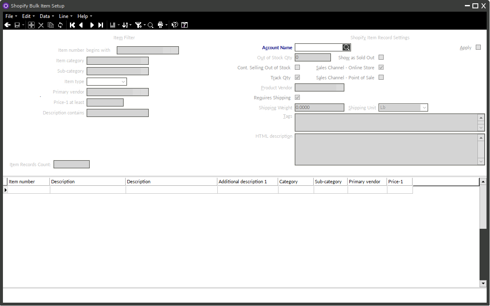
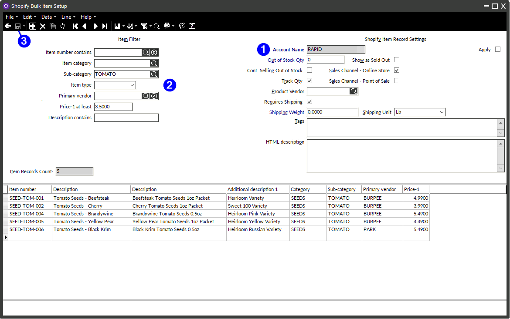
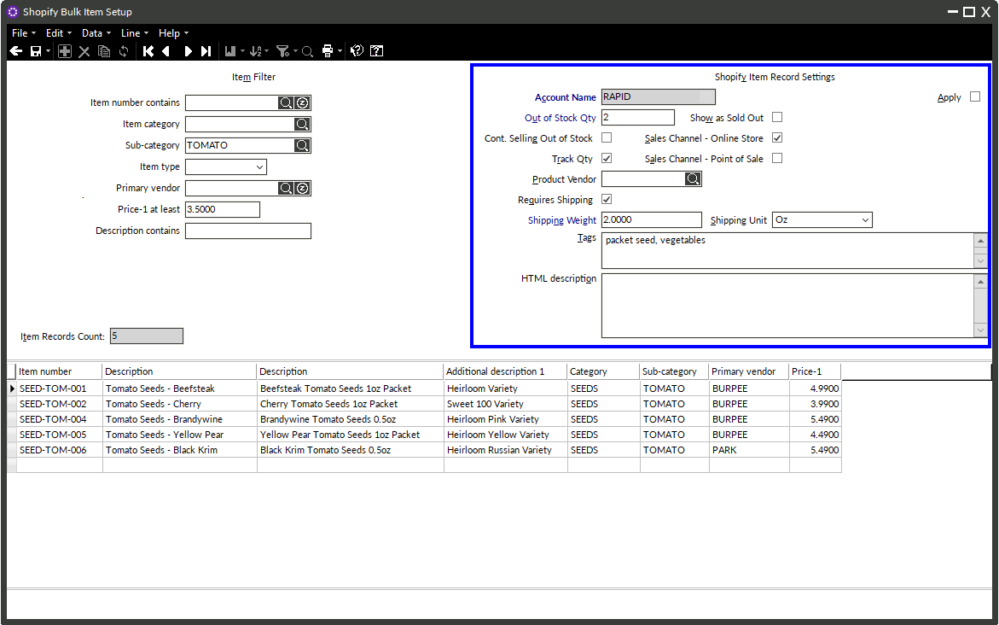
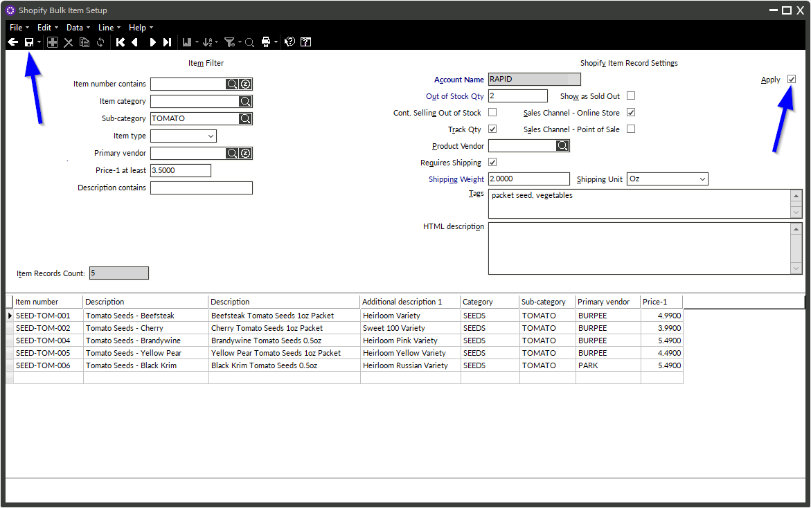

# Shopify Bulk Item Setup Tool

_Updated June 18, 2026_

Instead of creating Shopify item records one at a time, the Shopify Bulk Item Setup tool lets you create Shopify item records for many Counterpoint items at once.

## Availability

The Shopify Bulk Item Setup is introduced in **Shopify connector version 3.1**, which is the newest CI/CD version of the connector.

## Before You Begin: Important Things to Know

- **This tool only creates new Shopify item records.** It applies only to Counterpoint items that do not yet have a Shopify item record, and the items table will only show those items. It cannot be used to edit existing Shopify item records — those must still be edited one at a time.
- **Every item in a batch gets the same settings.** The Shopify item record settings you choose are applied to *all* items in the filtered group. Plan to work in batches of items that should share the same settings (see [Working in Batches](#working-in-batches) below).
- **There is no confirmation prompt and no undo.** Checking the **Apply** box and clicking **Save** immediately creates the Shopify item records. If settings are applied to items and you later wish to change them, the only fix is to delete or edit those Shopify item records individually — review your item list and settings carefully before applying.

## Quick Reference

1. [Open Connectors → Shopify → Shopify Bulk Item Setup](#1-open-the-tool)
2. [Select your account](#2-select-your-account)
3. [Build the item filter](#3-build-your-item-filter) → click Save
4. [Review the items in the table](#4-review-the-items-in-the-table) — adjust the filter and re-save if needed
5. [Set the Shopify item record settings for this batch](#5-configure-the-shopify-item-record-settings)
6. [Check Apply → click Save](#6-apply-and-save) (records are created immediately)
7. [Press the back arrow and repeat for the next batch](#7-repeat-for-the-next-group)

## Using the Shopify Bulk Item Setup

### 1. Open the tool

In Counterpoint, go to **Connectors → Shopify → Shopify Bulk Item Setup**.

When the screen opens, you will see the **item filter** on the left, the **Shopify item record settings** on the right, and a table at the bottom.

### 2. Select your account

Select your account name from the lookup. Most clients have only one account. Selecting the account unlocks the item filter and the Shopify item record settings.

### 3. Build your item filter

Best practice is to set up the item filter first. This works just like item filters elsewhere in Counterpoint:

- Use the fields already present in the filter, or right-click anywhere in the filter and choose **Customize** to add other fields.
- Filters support **AND/OR** logic, and you can indent conditions to nest one condition under another.
- Example filters: a range of item numbers, a specific category, or a subcategory where the price is at least $5.00.

When your filter is ready, click **Save**.

### 4. Review the items in the table

After you click **Save**:

- The **item record count** box below the filter updates to show how many items matched.
- The table at the bottom populates with every matching item that does not yet have a Shopify item record. (Items that already have a Shopify item record will not appear, even if they match the filter.) For example, if the filter returns 25 items, all 25 appear in the table.

To change which columns are visible, right-click the table header, choose **Column Designer**, and select the columns you want. The table is only for reviewing which items are included in the batch — the visible columns have no impact on what is synced.

**No Shopify item records are created at this point.** This step is only for identifying which items will be affected. If the results are not quite right, adjust the filter and click **Save** again — the count and the table will refresh. Take the time to carefully dial in exactly the items you want.

Note that the filter is the only way to control which items are included. Individual rows cannot be deselected or removed from the table. If the table shows 25 items and you only want 24 of them, find a way to filter out the unwanted item.

### 5. Configure the Shopify item record settings

Once the table shows exactly the items you want, move to the **Shopify item record settings** on the right. All of these settings will be applied to **every** Shopify item record created in this run.

The fields come prepopulated with your typical defaults. Review them and change any you want to be different for this group of items. Whatever is visible on screen — every value, checkbox, lookup, dropdown, and number — is exactly what will be applied.

### 6. Apply and save

When you are certain the item list and the settings are correct:

1. Check the **Apply** checkbox.
2. Click **Save**.

This immediately creates the Shopify item records for every item in the table — there is no confirmation prompt. Counterpoint will not allow you to close the window until all of the records have been created. This is typically very fast: the connector can create roughly 2,000 records in under 10 seconds.

### 7. Repeat for the next group

To create Shopify item records for another batch of items, clear the screen by pressing the back arrow and repeat the process: build a new filter, click **Save**, review the table, set the Shopify item record settings for that batch, check **Apply**, and click **Save**. You can repeat this as many times as needed.

## Working in Batches

Because every item in a run receives the same Shopify item record settings, break your items into groups that share the same settings and run the tool once per group. For example, within a subcategory you want fully synced to Shopify, you might run:

1. All products with a shipping weight of 1 lb
2. All products with a shipping weight of 2 lbs
3. All products with an out-of-stock quantity of 5 and a shipping weight of 15 lbs

## After the Records Are Created

The Shopify item records appear in Counterpoint **immediately**. You can spot-check them by opening an item in Counterpoint and viewing its Shopify item record.

Syncing those records up to Shopify takes longer:

- As the connector runs, products sync **one at a time**, each taking several seconds. Large batches may take **hours** to fully appear on Shopify, so do not be alarmed if products are not visible there right away.
- You can check the **sync status** on an individual Shopify item record: a status of **1** means the record is in the queue waiting to be synced, and a status of **2** means it is actively syncing.
- If an error occurs, a notification appears in the Counterpoint **Message Center**, and users in the alert message group will be notified.

## Need Help?

If you get stuck or have questions, contact Rapid support at [support@rapidpos.com](mailto:support@rapidpos.com).
