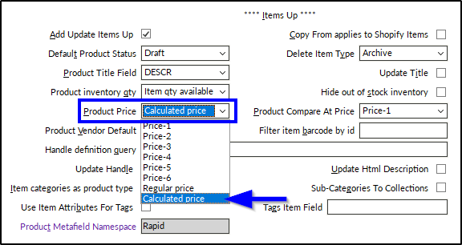
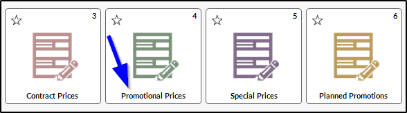
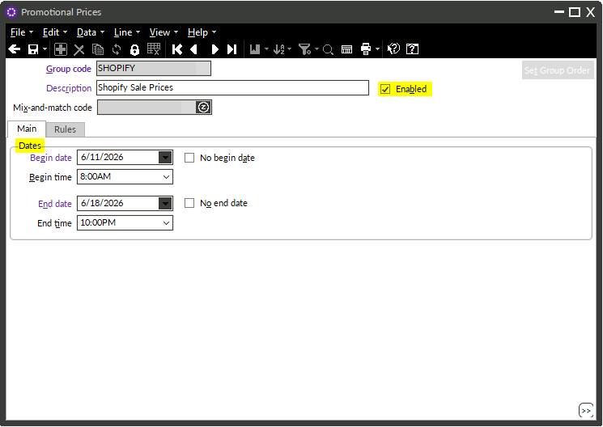
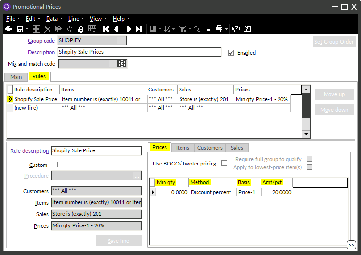
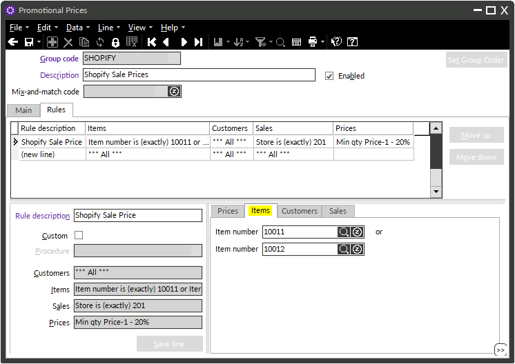
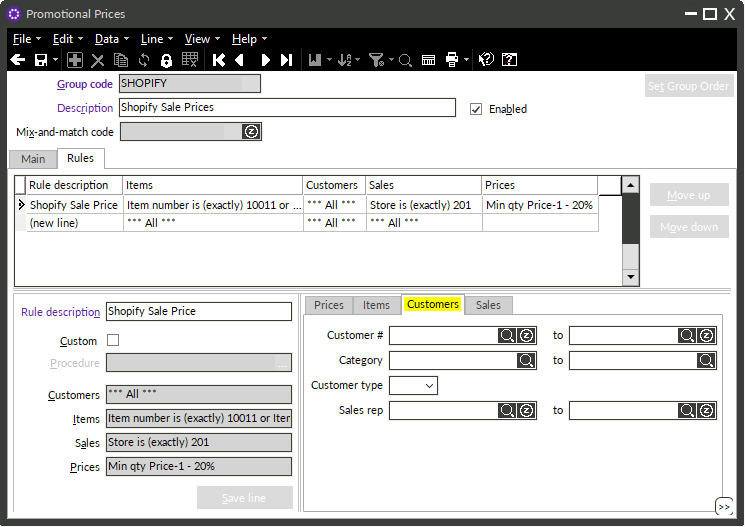
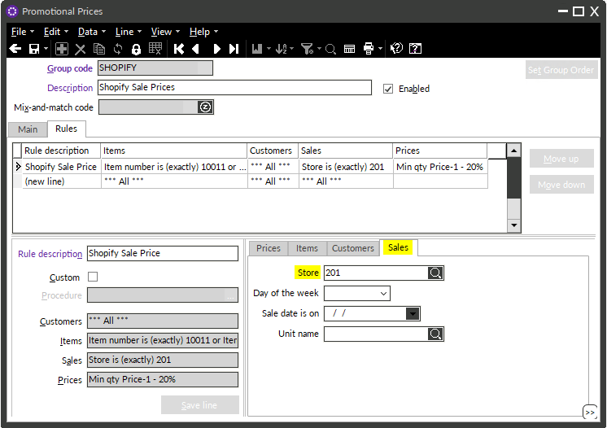

# Using Promotional (Calculated) Prices with the Shopify Connector

_Updated: June 9, 2026_

Rapid's Shopify Connector can be configured to sync promotional prices, allowing sale prices set in Counterpoint to display automatically on your Shopify storefront.

For most use cases, **we strongly recommend using Shopify's native Discounts functionality to manage sale prices directly in Shopify**. However, if you prefer to manage promotional prices in Counterpoint and push them to Shopify, that can be done using the Calculated Price method described in this guide — including [one-time configuration](#1-shopify-connector-configuration), [promotion rules](#2-setting-up-a-promotional-price), and [troubleshooting](#3-troubleshooting).

---

## 1. Shopify Connector Configuration

In the Shopify Connector, set **Product Price** to **Calculated Price**.

If this was not previously configured, contact Rapid to schedule a full item resync to update prices on Shopify.

---

## 2. Setting Up a Promotional Price

Only prices set up in **Promotional Prices** will sync to Shopify as a calculated price. Other discount types (Contract Prices, Special Prices, Planned Promotions) are not supported by the connector.

Navigate to **Promotional Prices** in Counterpoint and create or edit a promotion. 
- The group code and description can be anything you choose.
- You can also have multiple promotions enabled and syncing at the same time.
- Every promotion that syncs to Shopify must meet all of the requirements below.

### Main Tab - Enabled flag and dates

| Field | Requirement |
|---|---|
| Enabled | Must be **checked** |
| Begin date | Set a **specific date** or check **No begin date** |
| Begin time | Defaults to **Beginning of day** — adjust if needed (e.g., 8:00 AM) |
| End date | Set a **specific date** or check **No end date** |
| End time | Defaults to **End of day** — adjust if needed (e.g., 10:00 PM) |

If using specific dates, the promotion will activate and deactivate automatically at the configured times. 

If no dates are set, the promotion runs indefinitely until manually disabled.

### Rules Tab — Prices

| Field | Requirement |
|---|---|
| Min qty | Leave as **0** (not used by the connector) |
| Method | Must be **Discount amount** or **Discount percent** |
| Basis | Must be **Price-1** |
| Amt/Pct | Must be **greater than 0** |

### Rules Tab — Items

The item filter must use **"is exactly"** and target either **item number(s)** or **item category(s)** — no other filter types will sync.

You can include multiple item numbers or categories in a single rule.

### Rules Tab — Customers

Leave all customer filters **blank**. Customer filters are not used by the connector.

### Rules Tab — Sales

The store filter must be either:
- **Blank** — applies the promotion to all stores, including Shopify, or
- **"is exactly" 201** — limits the promotion to the Shopify store only

If filtering by store, the operator must be set to **"is exactly"** — no other operator will sync.

---

## 3. Troubleshooting

If a Shopify price is not reflecting the promotional price:

1. **Check the connector config** — confirm Product Price is set to **Calculated Price**.
2. **Review the promotion rules** — make sure all requirements above are met. Pay close attention to the item filter using **"is exactly"** and only filtering by item number or category.
3. **Check the Shopify Items record** — confirm the item has an **active** item record and the **Shopify ID** is correct.
4. **Force a resync** — check the **Resync** box on the Shopify Items record and then save it. Either run the connector manually or wait for the next scheduled sync.
5. **Watch the tutorial** — video instructions are available at [counterpointuniversity.com/ecommerce-connectors](https://counterpointuniversity.com/ecommerce-connectors/).

If none of the above resolves the issue, submit a support ticket to [support@rapidpos.com](mailto:support@rapidpos.com).
